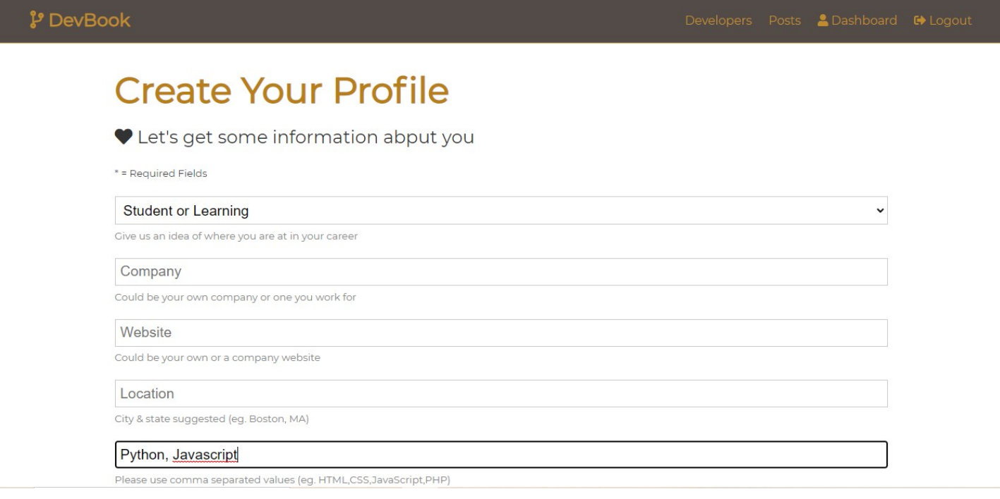
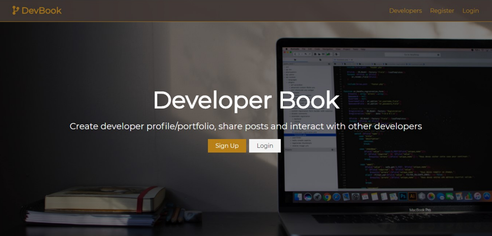
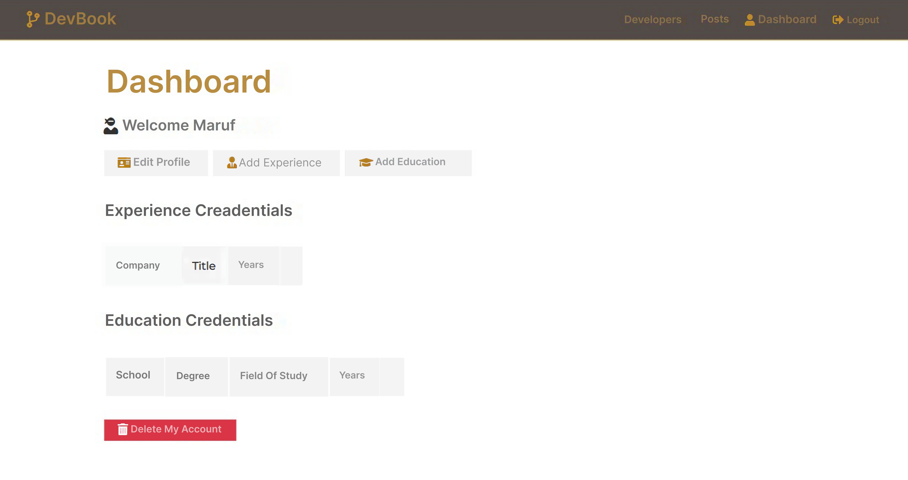

# Developer Book

This is a MERN stack-based project where users can create an account, sign in, sign up, create and update their profile, and manage their personal information. It's mainly designed for developers to maintain a personal website and keep notes.

## Features

- User account creation
- Sign up and sign in
- Profile creation and updates
- Manage personal notes
- Built with MERN stack (MongoDB, Express.js, React.js, Node.js)

## Tech Stack

- [MongoDB](https://www.mongodb.com/)
- [ExpressJS](https://expressjs.com/)
- [ReactJS](https://reactjs.org/)
- [NodeJS](https://nodejs.org/en/)

## Screenshots

### 1. Profile Creation


### 2. Home Page


### 3. Dashboard


## Installation

1. Clone the repo:
   ```bash
   git clone https://github.com/maruf119459/Developer-Book.git
